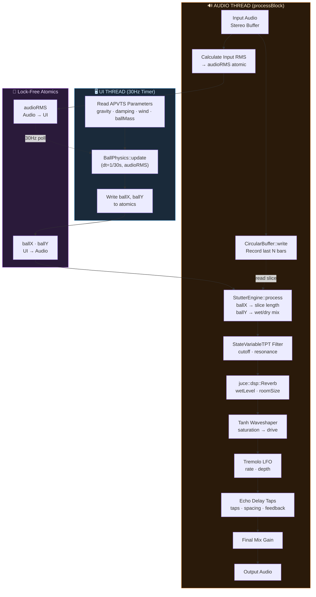

# Gravitas

A physics-driven stutter sampler plugin for VST3 and AU. A ball orbits a gravitational field — its position in real time determines how your audio gets sliced, looped, and stuttered. Every planet preset applies a distinct physical character to the motion, and the ball's trajectory shapes the sound continuously without you touching a thing.

Inspired by Ableton's Beat Stutter Max4Live device.

**Developer:** ZetaSonic
**Formats:** VST3 · AU
**Platform:** macOS

---

## How it works

The plugin records a continuous circular buffer of your incoming audio (the last 1–8 bars, configurable). A physics-simulated ball moves in a 2D gravitational field. Its position is read 30 times per second and mapped to two stutter parameters:

| Ball axis | Effect |
|---|---|
| X (left/right) | Slice length — centre = 1 bar (minimal stutter), edges = 1/32 note (intense chop) |
| Y (top/bottom) | Wet/dry mix — top = 100% stuttered, bottom = 100% dry |

The ball is pulled toward the centre by a spring (gravity), slowed by atmospheric drag (damping), and buffeted by random impulses (wind). Audio loudness also kicks the ball outward. The result is an ever-changing, organic stutter pattern that breathes with the music.

---

## Planet Presets

Each planet loads an artistic interpretation of its physical properties as sound parameters. Click a planet button to switch preset. Parameters can be adjusted freely after loading.

| Planet | Character | Notable features |
|---|---|---|
| ☿ **Mercury** | Bright, relentless, perpetual bounce | Zero damping (infinite oscillation), no reverb, very bright filter (12 kHz), no echo |
| ♀ **Venus** | Slow, smothered, reversed | High damping (lazy drift), reverse playback, crushing reverb (75% wet, 6s decay), resonant filter |
| ♁ **Earth** | Balanced, musical | Moderate everything — a good starting point |
| ♂ **Mars** | Sparse, cold, drifty | Very low gravity and damping (long slow arcs), dark filter (2.5 kHz), 2 close echo taps (Phobos + Deimos) |
| ♃ **Jupiter** | Chaotic, massive, heavy saturation | Very high gravity + wind (rapid chaotic bouncing), heavy magnetic saturation (80%), 8 echo taps, fast tremolo |
| ♄ **Saturn** | Ringed, spacious, resonant | High resonance filter (Q=3.0) for ring-like comb character, majestic reverb (65%, 5s), 8 wide echo taps |
| ⛢ **Uranus** | Sideways, strange, turbulent | Axes swapped (Y drives slice length, X drives wet/dry), reverse playback, high wind, very cold filter (800 Hz) |
| ♆ **Neptune** | Maximum chaos, darkest, coldest | Maximum wind (1.0), very low damping (wild unpredictable drifts), darkest filter (500 Hz), 4 echo taps |

---

## Parameters

### PHYSICS
These control the ball's movement, which drives the stutter in real time. Changes are reflected immediately in the field visualization.

| Parameter | Range | What it does |
|---|---|---|
| **Gravity** | 0.01 – 1.0 | Spring force pulling the ball toward the centre. Higher = tighter oscillation, faster return to centre, more predictable stutter pattern. Visualized as the number and brightness of contour rings. |
| **Atmosphere** | 0.0 – 0.99 | Velocity damping per frame. Higher = ball slows down quickly and settles near centre (minimal stutter). Lower = ball coasts and drifts freely for longer. Visualized as a dense fog overlay. |
| **Wind** | 0.0 – 1.0 | Random impulse applied to the ball each tick. Higher = chaotic, unpredictable trajectory. Visualized as bowing and turbulence in the radial field lines. |
| **Ball Mass** | 0.1 – 2.0 | Inertia. Heavier balls are harder to accelerate and change direction more slowly, producing slower-evolving stutter patterns. Visualized as the physical size of the ball. |

### STUTTER
| Parameter | Range | What it does |
|---|---|---|
| **Capture Bars** | 1 – 8 | How many bars of live audio to keep in the circular buffer. The stutter engine only reads within this window, so shorter = tighter feedback loop, longer = can stutter from further back in time. Takes effect immediately. |

### FILTER
A lowpass state-variable filter applied to the full signal after stuttering.

| Parameter | Range | What it does |
|---|---|---|
| **Cutoff** | 200 – 18000 Hz | Lowpass cutoff frequency. High values (Mercury, 12 kHz) sound open and bright. Low values (Neptune, 500 Hz) are dark and muffled. |
| **Resonance** | 0.1 – 4.0 | Filter Q. High values add a resonant peak at the cutoff, producing a whistling or ring-like character (Saturn uses Q=3 for this effect). |

### REVERB
| Parameter | Range | What it does |
|---|---|---|
| **Reverb Wet** | 0.0 – 1.0 | Blend between dry and reverb signal. Mercury = 0 (no atmosphere). Venus = 0.75 (crushing density). |
| **Reverb Decay** | 0.1 – 8.0 s | Reverb tail length. Maps to room size internally. |

### SATURATION / TREMOLO
| Parameter | Range | What it does |
|---|---|---|
| **Saturation** | 0.0 – 1.0 | Tanh soft-clip drive. 0 = clean. 1 = heavily distorted. Jupiter uses 0.8 to represent its enormous magnetic field. |
| **Tremolo Rate** | 0.01 – 4.0 Hz | Speed of the amplitude LFO. |
| **Tremolo Depth** | 0.0 – 1.0 | Amount of amplitude modulation. 0 = no tremolo. |

### ECHO
Up to 8 delay taps with decaying feedback. Each tap is spaced a musical interval apart.

| Parameter | Range | What it does |
|---|---|---|
| **Echo Taps** | 0 – 8 | Number of delay taps. 0 = no echo. Mars has 2 (Phobos + Deimos). Jupiter and Saturn max out at 8. |
| **Echo Spacing** | 0.125 – 1.0 beats | Time between taps in beats. 0.125 = 1/8 note (tight rhythmic echo). 1.0 = 1 bar apart (wide, spacious). |
| **Echo Feedback** | 0.0 – 0.8 | How much each tap feeds back. Higher = longer decaying echo tail. |

### OUTPUT
| Parameter | Range | What it does |
|---|---|---|
| **Mix** | 0.0 – 1.0 | Overall output level after the full DSP chain. |

---

## Field Visualization

The left panel shows the gravitational field and ball in real time.

| Visual element | Represents |
|---|---|
| Concentric rings | Equipotential contours. Count and brightness scale with **Gravity**. |
| Radial dashed lines | Field lines. They bow and deviate with **Wind** — more chaos = more turbulence. |
| Coloured fog | Atmospheric density. Thickens with **Atmosphere** (damping). |
| Ball size | Scales with **Ball Mass**. |
| Ball glow + trail | Ball speed — faster movement = longer trail and larger glow. |
| Gravity tether | Line from centre to ball, thickness scales with gravity strength. |
| Speed rings | Emitted when the ball moves fast, expand outward and fade. |
| Boundary flash | Pulse when the ball hits the ±1 boundary walls. |
| HUD (bottom-right) | Live readout: `G:x.xx  D:x.xx  W:x.xx  M:x.xx` — updates every frame. |

---

## Signal Flow



### Thread safety

| Bridge | Direction | Mechanism |
|---|---|---|
| `ballX`, `ballY` | UI timer → audio thread | `std::atomic<float>`, relaxed ordering |
| `audioRMS` | audio thread → UI timer | `std::atomic<float>`, relaxed ordering |
| All parameters | UI sliders ↔ audio thread | APVTS internal atomics via `getRawParameterValue` |

---

## Building

Requires JUCE installed at `~/JUCE` and Xcode command-line tools.

```bash
git clone <repo>
cd Gravitas
cmake -B build
cmake --build build --config Release
```

Output bundles appear at:
- `build/Gravitas_artefacts/Release/VST3/Gravitas.vst3`
- `build/Gravitas_artefacts/Release/AU/Gravitas.component`

Copy to your plugin folder and rescan in your DAW:
```bash
cp -r build/Gravitas_artefacts/Release/VST3/Gravitas.vst3 ~/Library/Audio/Plug-Ins/VST3/
codesign --force --deep --sign - ~/Library/Audio/Plug-Ins/VST3/Gravitas.vst3
```

---

## Project structure

```
Gravitas/
├── Source/
│   ├── PluginProcessor.h/cpp     — AudioProcessor, APVTS, DSP chain
│   ├── PluginEditor.h/cpp        — UI, planet field, param rows
│   ├── Physics/
│   │   ├── BallPhysics.h         — Spring-damper simulation (UI thread)
│   │   └── PlanetPresets.h       — 8 planet preset definitions
│   └── DSP/
│       ├── CircularBuffer.h/cpp  — Lock-free stereo ring buffer
│       └── StutterEngine.h/cpp   — Slice reader with crossfade
├── Assets/
│   └── Textures/                 — Planet surface JPEGs (CC BY 4.0, solarsystemscope.com)
└── CMakeLists.txt
```