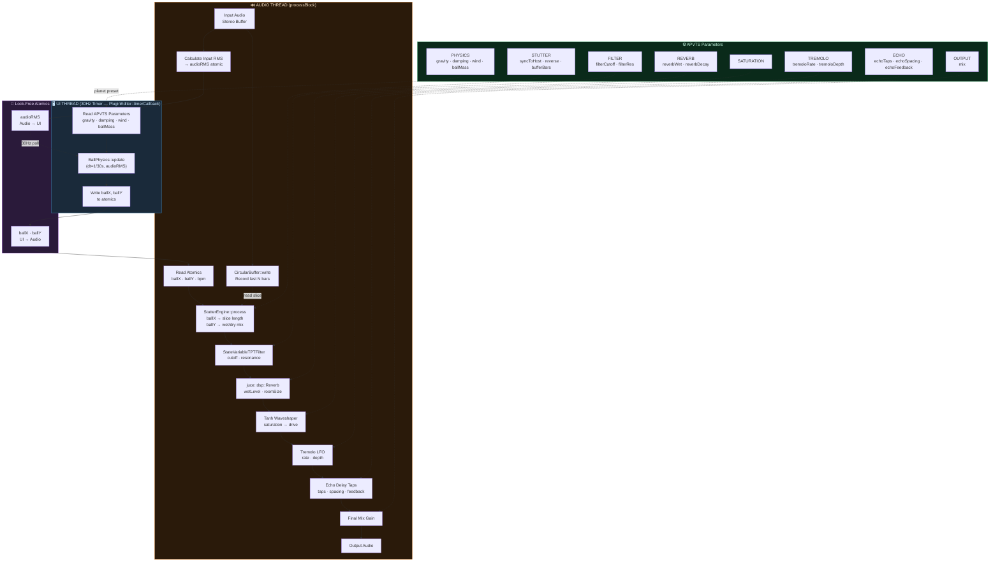

# Gravitas — Signal Flow

## Thread boundaries

| Bridge | Direction | Mechanism |
|---|---|---|
| `ballX`, `ballY` | UI timer → audio thread | `std::atomic<float>`, relaxed ordering |
| `audioRMS` | audio thread → UI timer | `std::atomic<float>`, relaxed ordering |
| All parameters | UI sliders → audio thread | APVTS internal atomics via `getRawParameterValue` |

## DSP chain order (processBlock)

1. **CircularBuffer write** — incoming audio recorded continuously
2. **StutterEngine** — reads a slice of the circular buffer; `ballX` sets slice length (1/32 note → 1 bar), `ballY` sets wet/dry
3. **StateVariableTPT Filter** — lowpass, cutoff + resonance from APVTS
4. **Reverb** — `juce::dsp::Reverb`, wet level + room size
5. **Saturation** — `tanh(x · drive) / tanh(drive)` soft clip
6. **Tremolo** — sine LFO amplitude modulation
7. **Echo** — up to 8 delay taps with feedback
8. **Mix** — final output gain